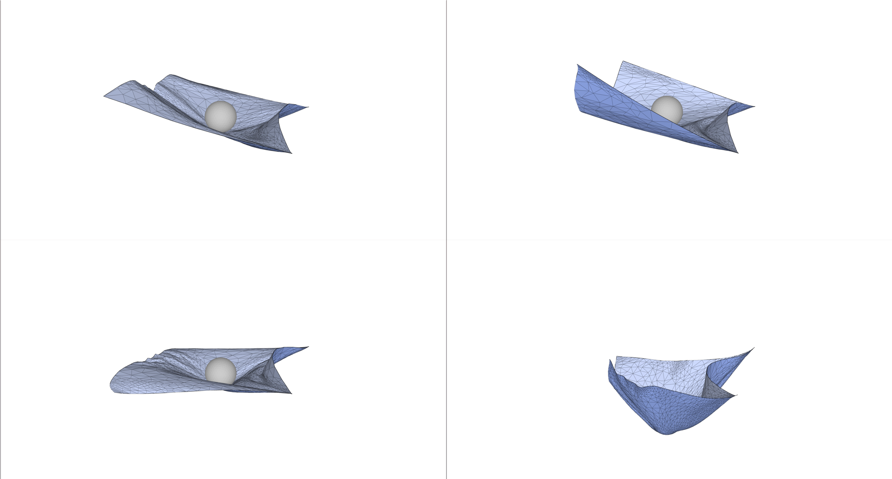

# Cloth Simulator-Milestone

### What we have done

- Read several relevant papers.
- Setup the environment and successfully run the project http://graphics.berkeley.edu/papers/Narain-AAR-2012-11/.
- Try to understand how the project deals with collisions between cloth and spheres.

### Preliminary results

- Here are the images of a collision between cloth and a sphere.

  

  

### What we will do

- Improve the way collisions are handled. For example, we will consider how collisions occur between different materials, such as cloth and square, cloth and cloth, etc. In addition, we will explore different angles of collisions. For instance, two objects may collide vertically or at different angles.
- We may explore different ways of collision detection, while possibly learning different ways of acceleration (BVH, Uniform Grid, etc).
- Design some cloth materials by ourselves.
